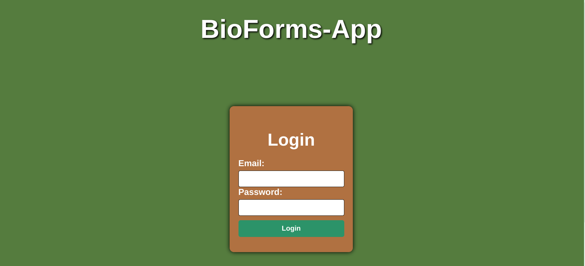
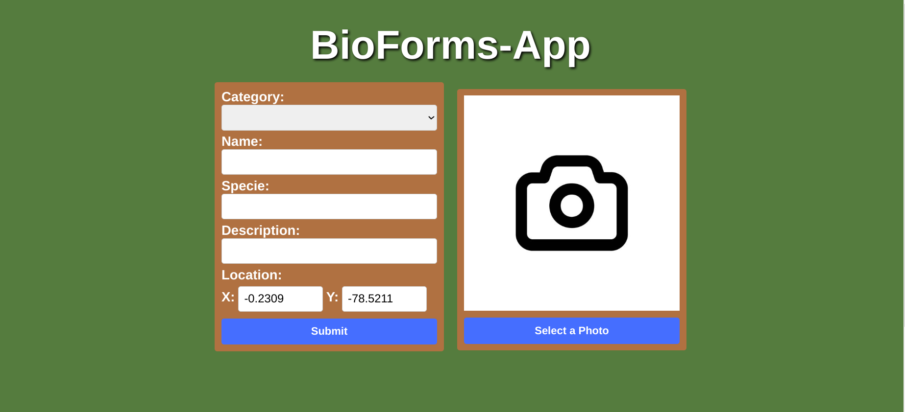
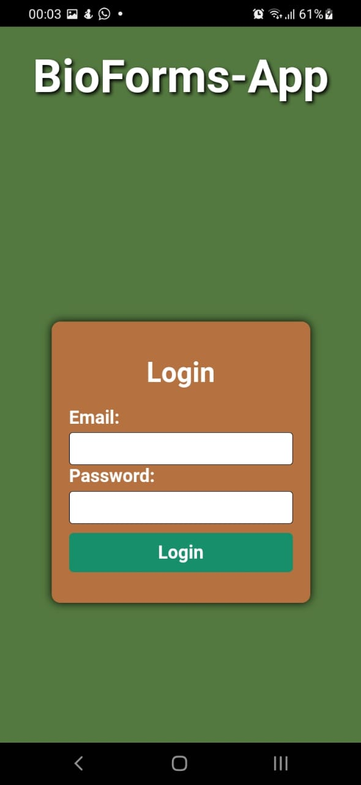
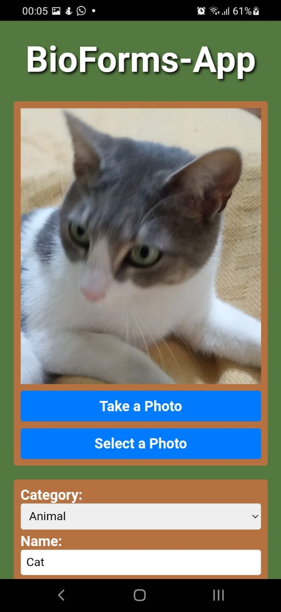
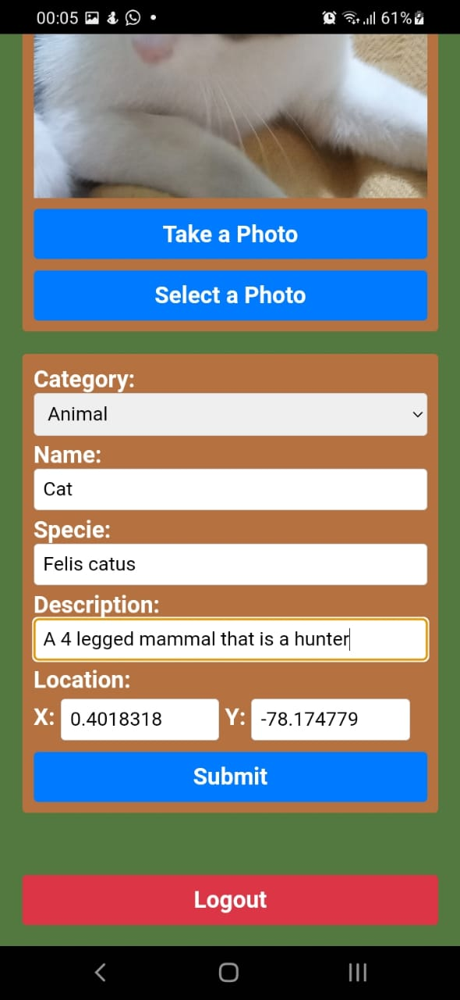

# BioForms-App

BioForms-App is an Angular application with Capacitor support that allows users to capture biological information, geolocation data, and images of animals or plants. The application is available for both web and Android platforms. It features user authentication and data storage in Supabase, along with robust data validation.
## Table of Contents
- Introduction
- Features
- Getting Started
- Connecting to Supabase
- Data Validation
- Screenshots
- Contributing
- License

## Introduction
BioForms-App is designed to streamline the process of capturing biological data and geolocation information for various classes of animals and plants. Users can utilize the application on both web and Android devices, making it convenient and accessible in various environments.

## Features
- Capture and store biological information of animals and plants.
- Collect and save geolocation data for each entry.
- Upload and display images of animals or plants.
- User authentication for data submission.
- Responsive design for seamless use on both web and Android platforms.

## Getting Started
Follow these steps to get the BioForms-App up and running on your local environment:
1. Clone this repository to your local machine.
1. Install the required dependencies by running **'npm install'**.
1. Launch the application on the web with **'ng serve -o'** or on Android with Capacitor support using **'ionic cap run android'**.

## Connecting to Supabase
BioForms-App utilizes Supabase as the backend for data storage and retrieval. Supabase provides a secure and scalable database solution, enabling seamless data management for the application.
To connect BioForms-App to Supabase:
1. Sign up for a Supabase account at https://supabase.io/.
1. Create a new project in Supabase and obtain your API key and URL.
1. Replace the placeholder values in the application code with your Supabase API key and URL to establish the connection at the **supabase.service.ts** file.
   
## Data Validation
Data validation is a crucial aspect of BioForms-App to ensure that accurate and relevant information is captured. The application incorporates robust data validation techniques to ensure that the data conforms to the required standards and prevents any discrepancies or errors.

## Screenshots
### Web version

### Mobile android version

## License
This project is licensed under the MIT License. Feel free to use and modify this codebase according to the terms of the license.

